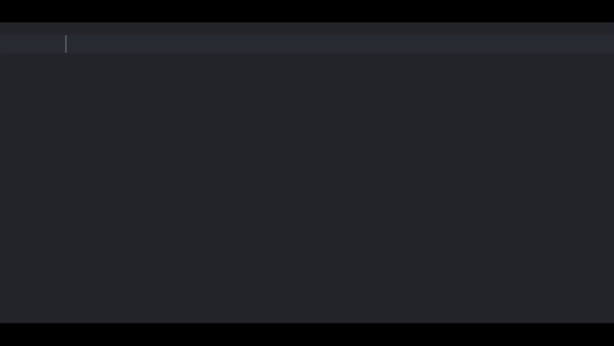

# Xcode Code Snippets

Essential Swift code snippets you should incorporate into every Xcode project for improved efficiency and functionality.

## How to use?
1. Open Finder and press `cmd + shift + G`
2. In the search bar, paste `~/Library/Developer/Xcode/UserData/CodeSnippets/` and click "Go".
3. If the folder doesn't exist, create it.
4. Once the folder opens, paste all the `.codesnippet` files into it.
5. Restart Xcode
6. To access the `snippets`, 	start typing snippet in your code editor, and the newly added snippets will appear.

